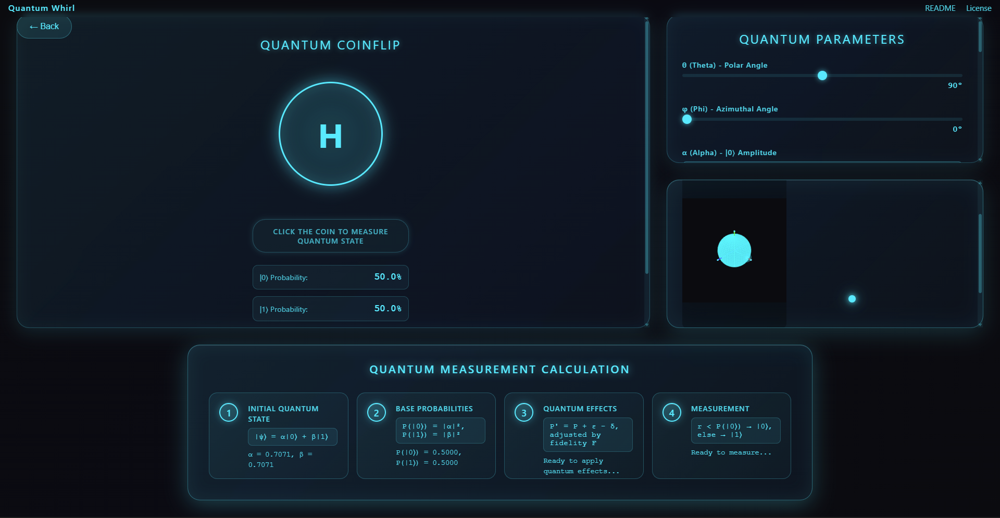

# 🌌 Quantum Whirl: Interactive Quantum Computing Simulator

<p align="center">
  
  
  
  
</p>

<p align="center">
  <a href="https://github.com/Muhib-Mehdi" target="_blank">
    
  </a>
  <a href="https://www.linkedin.com/in/muhib-mehdi-677bb7391" target="_blank">
    
  </a>
</p>

<p align="center">
  <strong>An immersive educational tool for exploring quantum computing concepts through interactive visualization</strong>
</p>

<p align="center">
  
</p>

## 🚀 Overview

**Quantum Whirl** is a cutting-edge interactive simulator that brings the fascinating world of quantum computing to your browser. Experience quantum phenomena like superposition, measurement, and entanglement through an intuitive interface featuring:

- **Quantum Coinflip**: Visualize quantum measurement outcomes with a mesmerizing animated coin
- **Bloch Sphere Visualization**: See how quantum states evolve in real-time on the fundamental representation of a qubit
- **Parameter Control**: Manipulate quantum parameters (θ, φ, phase) to observe their effects on quantum states
- **Realistic Quantum Effects**: Explore decoherence, entanglement, and fidelity in an interactive environment

## 🧠 Educational Value

Quantum Whirl transforms abstract quantum concepts into tangible, interactive experiences:

| Concept | Visualization | Learning Outcome |
|---------|---------------|------------------|
| **Superposition** | Animated quantum coin in multiple states | Understand how qubits exist in multiple states simultaneously |
| **Measurement** | Probabilistic coin flip outcomes | Grasp the probabilistic nature of quantum measurement |
| **Bloch Sphere** | Interactive 3D representation | Visualize quantum states as points on a unit sphere |
| **Quantum Parameters** | Sliders for θ, φ, and phase | Learn how parameters control quantum state orientation |
| **Decoherence** | Adjustable environmental noise effects | Understand how quantum systems lose coherence |

## 🎯 Key Features

### 🔮 Quantum Coinflip
Experience quantum measurement through an interactive coin that exists in superposition until observed:
- Click the coin to trigger a quantum measurement
- Watch probabilities collapse to definite outcomes
- Visualize the quantum state evolution during measurement

### 🌐 Bloch Sphere Visualization
Interact with the fundamental geometric representation of a qubit:
- Real-time 3D visualization of quantum states
- Dynamic updates as parameters change
- Intuitive mapping of quantum states to points on the sphere

### ⚙️ Quantum Parameter Control
Fine-tune quantum properties to explore their effects:
- **θ (Theta)**: Polar angle controlling the latitude on the Bloch sphere
- **φ (Phi)**: Azimuthal angle determining the longitude
- **Phase (δ)**: Quantum phase affecting interference patterns
- **Entanglement Factor**: Simulate quantum correlations
- **Decoherence Rate**: Model environmental interactions
- **Fidelity**: Adjust measurement accuracy

### 📊 Real-time Calculations
Understand the mathematics behind quantum measurements:
1. **Initial Quantum State**: |ψ⟩ = α|0⟩ + β|1⟩
2. **Base Probabilities**: P(|0⟩) = |α|², P(|1⟩) = |β|²
3. **Quantum Effects**: P' = P + ε - δ, adjusted by fidelity F
4. **Measurement**: r < P(|0⟩) → |0⟩, else → |1⟩

## 🛠️ Quick Start

### Browser Method (Simplest)
Simply open [index.html](index.html) in your browser:

```bash
# Clone the repository
git clone https://github.com/yourusername/quantum-whirl.git

cd quantum-whirl

# Open in default browser (Windows)
start index.html

# Open in default browser (macOS)
open index.html

# Open in default browser (Linux)
xdg-open index.html
```

### Local Server Method (Recommended)
For the best experience, run a local server:

#### Using Python 3
```bash
# Navigate to the project directory
python -m http.server 8080

# Open http://localhost:8080 in your browser
```

#### Using Node.js
```bash
# Navigate to the project directory
npx http-server . -p 8080

# Open http://localhost:8080 in your browser
```

## 🌐 Deployment

### GitHub Pages
Deploy to GitHub Pages for public access:

1. Push your repository to GitHub
2. Go to Repository Settings → Pages
3. Select Source: Deploy from a branch
4. Branch: main, Folder: / (root)
5. Save and wait for deployment

### Other Static Hosts
As a static site, Quantum Whirl works with any static hosting service:
- Netlify
- Vercel
- Firebase Hosting
- AWS S3 + CloudFront

## 🧪 Technical Architecture

### Core Components

| Component | File | Purpose |
|----------|------|---------|
| **UI Engine** | [index.html](index.html) | Main interface and layout |
| **Quantum Logic** | [quantum.js](quantum.js) | Quantum state calculations and measurements |
| **Visual Effects** | [script.js](script.js) | Animations, particles, and cursor effects |
| **Styling** | [styles.css](styles.css) | Modern dark theme with cyberpunk aesthetics |
| **Configuration** | [package.json](package.json) | Project metadata and scripts |

### Dependencies
- [Three.js](https://threejs.org/) (CDN): 3D rendering for Bloch sphere
- Native JavaScript ES6+: Core functionality
- HTML5 Canvas: Particle background and Bloch visualization
- CSS3: Advanced animations and styling

## 🤝 Contributing

We welcome contributions that enhance the educational value and technical excellence of Quantum Whirl:

### Areas for Improvement
- [ ] Add unit tests for quantum.js mathematical functions
- [ ] Implement tutorial mode for quantum computing beginners
- [ ] Bundle Three.js locally to eliminate CDN dependency
- [ ] Add support for multi-qubit systems and entanglement visualization
- [ ] Create interactive quantum circuit builder
- [ ] Implement quantum algorithms (Deutsch-Jozsa, Grover's, etc.)
- [ ] Add export/import functionality for quantum states
- [ ] Improve accessibility for screen readers

### Development Guidelines
1. Fork the repository
2. Create a feature branch
3. Implement your enhancement
4. Test thoroughly
5. Submit a pull request with detailed description

## 📄 License

This project is licensed under the MIT License - see the [LICENSE](LICENSE) file for details.

## 🙏 Acknowledgments

- Inspired by quantum computing pioneers and educators
- Built with modern web technologies for maximum accessibility
- Designed to make quantum concepts approachable for learners of all backgrounds

## 📞 Support

For questions, issues, or feedback:
- Open an issue on GitHub
- Contact the maintainers
- Join our community discussions

---

<p align="center">
  Made with ❤️ and quantum entanglement<br/>
  <strong>Explore the quantum realm today!</strong>
</p>
